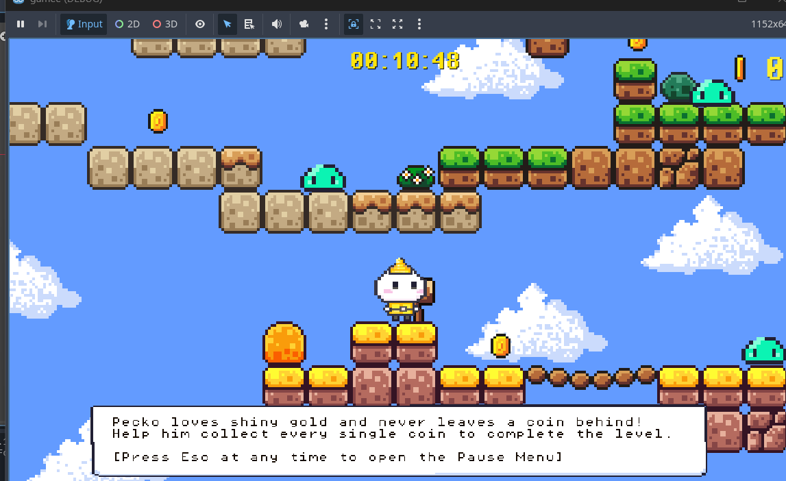

PECKO'S COIN RUSH ☆*: .｡. o(≧▽≦)o .｡.:*☆

A 2D platformer built with Godot where players collect coins, avoid slime enemies, and Complete lvl with "TA--DAAA".
It's just a simple game though i'm looking forward to making more i hope you enjoys it 

<p align="center">
  
</p>

Play the game in your browser with link below

**https://miyakostarry.itch.io/peckos-coin-rush**


FEATURE ᓚᘏᗢ--------------------------------------
game is basic beginner platformer game 

-collect coin to win the game 

- avoid slimes

this is the one of first game i have completed completely made with [GODOT Engine]


Clone the repository

```bash
git clone https://github.com/miyakostarry/PECKO-platformer.git
```

Credits & Acknowledgements


The following were created by me:
-Player character

-Slime enemie

-Background artwork

-Level design

-User interface and menus

-Main gameplay music and background music
------------------------------------------------------
ASSETS ╰(*°▽°*)╯

Sounds  φ(*￣0￣)
--------------------------------------------------
-Brackeys

-Asbjørn Thirslund

[THE assets i used here were in brackey's platformer blunder so i have credited whoever he credited in his credits]

Font ^o^

-Jayvee Enaguas (HarvettFox96)

Platform & Coin Sprites

-Four Seasons Platformer Sprites

-Brackeys' Platformer Bundle

Menu Music O.O

-Generated using Gemini
[AI tools were used during development as learning and development assistants for-]

-Understanding Godot Engine concepts

-Debugging errors

-Learning GDScript

-Exploring implementation ideas

---------------------------------------------------------
and... lots of them ☆*: .｡. o(≧▽≦)o .｡.:*☆ OwO ^o^

License

This project was created for learning and educational purposes.

All third-party assets remain the property of their respective creators and are credited above.
